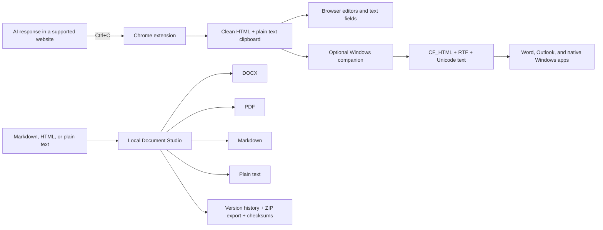

# AI Clean Paste

AI Clean Paste is a privacy-first toolkit for turning copied AI responses and text markup into clean, portable documents.

It solves two related problems:

1. Copying an answer from an AI website often brings along broken spacing, provider-specific styling, interface buttons, tracking parameters, or flattened lists.
2. Turning that answer into a reusable Word document or PDF usually requires manual cleanup and gives no reliable record of the source, version, or output checksums.

AI Clean Paste addresses both without sending the copied or converted content to a cloud service. The repository contains a Chrome extension, an optional Windows clipboard companion, and a local Document Studio.

> [!IMPORTANT]
> Version `0.2.0` is implemented and tested, but this repository does not currently publish GitHub Release assets, a signed installer, or a Chrome Web Store package. Non-developers need a ZIP supplied by the repository owner, or help from a developer to build one. Windows may show a SmartScreen warning for locally built, unsigned executables.

## At a glance

| Part | What it does | When to use it | Platform |
| --- | --- | --- | --- |
| Chrome extension | Replaces a normal copy from a supported AI response with clean semantic HTML and faithful plain text | Pasting into Gmail, Google Docs, Notion, browser editors, or text fields | Chrome/Chromium |
| Windows companion | Adds RTF to recognized AI-origin clipboard content for native applications | Pasting into Microsoft Word, classic Outlook, and other Windows rich-text applications | Windows 11 |
| Document Studio | Converts Markdown, HTML, or plain text into DOCX, PDF, Markdown, and text files | Creating downloadable, versioned documents instead of pasting | Windows, Linux, macOS; Windows has the packaged desktop build |
| HAI connector | Exposes token-protected document-generation endpoints in production, with deliberately limited authority | Integrating artifact generation into a separately operated HAI instance | Any supported Studio deployment |

All four interfaces use the same product principle: preserve useful document structure, remove unsafe or provider-only markup, and state honestly what was and was not verified.

## What happens when you use it



The extension changes the clipboard only during a synchronous browser `copy` event and only when all of the following are true:

- AI Clean Paste is enabled;
- the source provider is enabled, or generic formatting was explicitly granted for that exact site;
- the selection is not empty;
- on a supported provider, the selection is inside an identified assistant-response container; and
- normalization succeeds.

If a precondition fails or normalization throws before clipboard takeover, the browser's original copy behavior is preserved. Once the handler cancels the native copy and begins writing the clean formats, a browser-level write exception can still result in a partial or empty clipboard; v0.2.0 cannot restore the original clipboard after that point.

## What formatting is preserved

The clipboard formatter and Document Studio focus on portable meaning rather than reproducing a provider's proprietary visual design.

Preserved where applicable:

- headings from level 1 through level 6;
- paragraphs and intentional line breaks;
- ordered, unordered, and nested lists;
- bold, italic, and inline-code emphasis;
- safe `http`, `https`, and `mailto` links;
- blockquotes;
- fenced or preformatted code blocks;
- tables;
- horizontal rules; and
- a readable plain-text representation for destinations that do not accept rich text.

Removed or intentionally excluded:

- scripts, stylesheets, forms, iframes, SVG, canvas, audio, video, and provider controls;
- copy buttons, toolbars, action rows, classes, CSS, visual-only wrappers, and tracking attributes;
- unsafe link protocols on both surfaces; the extension also removes common tracking query parameters, while Document Studio preserves the original URL for an allowed protocol;
- images, embedded widgets, equations, comments, and provider-only interactive elements in v1; and
- pixel-perfect provider typography.

## Supported AI source websites

The Chrome extension contains explicit adapters for:

| Provider | Recognized hosts |
| --- | --- |
| ChatGPT | `chatgpt.com`, `chat.openai.com` |
| Claude | `claude.ai` |
| Gemini | `gemini.google.com` |
| Microsoft Copilot | `copilot.microsoft.com` |
| Perplexity | `perplexity.ai` |
| Grok | `grok.com`, `x.com` |
| Manus | `manus.im`, `manus.space` |

Each provider can be disabled independently. Website interfaces change over time; when a provider changes its page structure, the adapter selectors may need maintenance.

Unknown websites are untouched by default. The extension popup can enable generic formatting for the current origin. Chrome then asks for that site's optional host permission. Disabling generic formatting removes the origin from the local allowlist and removes the optional permission.

## Choose the part you need

### “I copy AI responses into a website”

Use the Chrome extension. Browser-based destinations consume the clean clipboard normally; AI Clean Paste does not inject code into the destination.

### “I paste AI responses into Word or Outlook on Windows”

Use the Chrome extension and the Windows companion together. The companion recognizes the AI page's `SourceURL`, adds RTF, and writes CF_HTML, RTF, and Unicode text together.

### “I want an actual DOCX or PDF file”

Use Document Studio. Paste or type source text, select a template and output formats, then download individual files or a complete ZIP export.

### “I want to call this from another local system”

Use the Studio API or the bounded HAI connector. Production and non-loopback use require authentication.

### Guide map

- [Installation for non-technical Windows users](#installation-for-non-technical-windows-users)
- [Using Document Studio](#using-document-studio)
- [Developer quick start](#developer-quick-start)
- [Docker](#docker)
- [Configuration](#configuration)
- [HTTP API](#http-api)
- [HAI connector](#hai-connector)
- [Optional ngrok access](#optional-ngrok-access)
- [Data, backup, and restore](#data-model-retention-backup-and-restore)
- [Privacy and security](#privacy-and-security-boundaries)
- [Testing and quality gates](#testing-and-quality-gates)
- [Troubleshooting](#troubleshooting)
- [Known limitations](#known-limitations-and-non-goals)

## Installation for non-technical Windows users

The repository owner can build two dependency-contained folders:

- `AI-Clean-Paste-Studio-Windows-v0.2.0.zip`
- `AI-Clean-Paste-Companion-Windows-v0.2.0.zip`

These archives are generated locally by the release script; they are not currently attached to a public GitHub Release.

### Document Studio

1. Obtain the Studio ZIP from a trusted build or repository owner.
2. Extract the whole archive to a normal folder you can write to. Do not run the executable from inside the ZIP.
3. Double-click `AI-Clean-Paste-Studio.exe`.
4. Wait for the browser to open `http://127.0.0.1:8765`.
5. Keep the **AI Clean Paste — Document Studio** tray icon running while you use the application.
6. Use the tray menu to reopen or stop Studio.

The standalone build needs no separate Python, Node.js, Docker, or administrator installation. Its normal data directory is:

```text
%LOCALAPPDATA%\AI Clean Paste\Studio
```

Microsoft Word is optional. When it is installed, Studio uses an isolated Word process to render-check DOCX files. Without Word, DOCX output can still be structurally checked, but it is not described as visually verified.

### Windows clipboard companion

1. Obtain and extract the companion ZIP.
2. Double-click `AI-Clean-Paste-Companion.exe`.
3. Use the tray menu to pause or resume automatic formatting.
4. Optionally enable **Start with Windows**. This uses the current user's standard Windows Run key and does not require administrator rights.
5. Choose **Quit** in the tray menu to stop it.

The companion acts only on clipboard entries containing CF_HTML whose `SourceURL` host is on the supported-provider allowlist. This is a host-level boundary, not assistant-response detection: copying a prompt, navigation text, or other rich content from an allowlisted AI page can also be normalized. Pause the companion when that is not desired. Copies from hosts outside the allowlist and copies without CF_HTML are left unchanged.

### Chrome extension from a built ZIP

1. Extract `AI-Clean-Paste-Chrome-v0.2.0.zip` to a permanent folder.
2. Open `chrome://extensions`.
3. Enable **Developer mode**.
4. Select **Load unpacked**.
5. Choose the extracted folder containing `manifest.json`.
6. Pin AI Clean Paste, open its popup, and confirm that the master switch and desired providers are enabled.
7. Select part of an assistant response, press `Ctrl+C`, and paste normally.

Chrome may disable a manually loaded unpacked extension if its folder is moved or deleted.

## Using Document Studio

### Create a document

1. Open **Studio**.
2. Enter a document title.
3. Paste or type the source content.
4. Choose the input type. **Auto** is usually appropriate; explicit options are Markdown, HTML, and Plain text.
5. Choose a template.
6. Select one or more output formats.
7. Select **Generate files**.
8. Download individual files or select **Export** for a complete ZIP.

The four built-in templates are:

| Template ID | Display name | Intended use |
| --- | --- | --- |
| `standard_business_brief` | Standard business brief | Reports, proposals, and typical office documents |
| `google_docs_default` | Google Docs default | Portable Arial-based collaborative documents |
| `compact_reference_guide` | Compact reference guide | Dense instructions, checklists, and technical notes |
| `narrative_proposal` | Narrative proposal | Longer-form material with a serif reading style |

All templates currently use US Letter page geometry. They control margins, fonts, spacing, colors, tables, and code presentation.

### Understand verification labels

| UI label | API status | Meaning |
| --- | --- | --- |
| **Verified** | `verified` | The artifact was parsed and rendered to a non-blank page; page count and checks are recorded |
| **Structural** | `unverified` | The package parsed, but the required visual renderer was unavailable or could not complete |
| **Failed** | `failed` | A parse, render, or non-blank check failed; do not present the artifact as verified |

PDF visual verification uses `pdftoppm` from Poppler. DOCX visual verification on Windows uses Microsoft Word to export an isolated copy to PDF, then checks the rendered page. The verifier serializes Word rendering to avoid competing automation sessions.

### Correct an existing document

Open a project from **History**, change the source or title, and generate again. Studio creates a new immutable source version before generating the files. Artifacts remain associated with the version from which they were created.

### Export and delete

An export ZIP contains the selected source version, its generated artifacts, available verification previews, and a checksum manifest. SHA-256 values identify exact bytes; they are integrity hashes, not a digital signature or proof of authorship.

Deleting a project removes its project/version/artifact rows and local project directory. It intentionally retains metadata-only audit history, including the deletion event. If an API caller supplied `Idempotency-Key` headers, v0.2.0 does not purge those cached response rows during deletion; they can retain project IDs, titles, version/artifact metadata, sizes, and hashes, but not source document text. Export first if the material needs to be recoverable. Storage-device forensic recovery is outside the application's control.

## Developer quick start

### Prerequisites

- Git;
- Node.js 22 and npm;
- Python 3.11 or newer; Python 3.12 is used by the scripts and CI;
- Windows PowerShell for the supplied `.ps1` workflows;
- optional Microsoft Word for DOCX visual verification;
- optional Poppler/`pdftoppm` for local PDF visual verification; and
- optional Docker Desktop and ngrok for those deployment paths.

Clone and enter the repository:

```powershell
git clone https://github.com/Robert-Velhorst/011-Chatbot-to-Doc-x-or-s-text-markup-converte.git
Set-Location 011-Chatbot-to-Doc-x-or-s-text-markup-converte
```

### One-command local Studio setup on Windows

```powershell
.\scripts\run-local.ps1
```

The script:

1. creates `.venv` with Python 3.12 if needed;
2. installs the Python package in editable mode;
3. installs npm dependencies;
4. builds the React interface;
5. sets the data directory to `runtime/studio`; and
6. starts Studio on `http://127.0.0.1:8765`.

Optional script parameters:

```powershell
.\scripts\run-local.ps1 -Port 8877 -DataDir "runtime/my-studio"
```

Stop it with `Ctrl+C` in the terminal.

### Manual development setup

```powershell
py -3.12 -m venv .venv
.\.venv\Scripts\python.exe -m pip install -e ".[dev]"
npm.cmd install
npm.cmd run studio:build
$env:CLEAN_PASTE_DATA_DIR = "runtime/studio"
.\.venv\Scripts\clean-paste-studio.exe serve
```

For UI development with Vite:

```powershell
npm.cmd run studio:dev
```

The Vite development server proxies `/api` to Studio on port `8765`, so run the Python service separately.

### Build and load the Chrome extension

```powershell
npm.cmd install
npm.cmd run check
npm.cmd test
npm.cmd run build
```

Load `dist/chrome-extension` as an unpacked extension from `chrome://extensions`.

The Manifest V3 extension requests:

- local extension storage for switches and the exact generic-site allowlist;
- `scripting` and `activeTab` for permission-gated generic-site setup;
- fixed host access for the seven supported provider families; and
- optional `http://*/*` and `https://*/*` access, requested only for an origin the user enables.

All executable extension code is packaged locally. There is no remote runtime code.

### Run or build the Windows companion

Run from source:

```powershell
py -3.12 -m venv .venv
.\.venv\Scripts\python.exe -m pip install -r src\windows\requirements.txt
$env:PYTHONPATH = "src\windows"
.\.venv\Scripts\python.exe src\windows\main.py
```

Build the dependency-contained folder:

```powershell
.\scripts\build-companion.ps1
```

Output: `dist/AI-Clean-Paste-Companion`.

The listener uses the Windows `AddClipboardFormatListener` notification API. It has no polling loop or global keyboard hook. A custom clipboard marker and content digest prevent processing its own output repeatedly.

### Build the standalone Document Studio

After creating `.venv`:

```powershell
.\scripts\build-standalone.ps1
```

Output: `dist/AI-Clean-Paste-Studio`.

The PyInstaller folder includes the production UI and Python dependencies. It is a portable folder build, not an installer and not code-signed.

### Command-line conversion

```powershell
.\.venv\Scripts\clean-paste-studio.exe convert fixtures\studio\sample-brief.md `
  --out outputs\sample `
  --formats docx,pdf,markdown,text `
  --template standard_business_brief
```

Available arguments:

```text
clean-paste-studio convert SOURCE
  --out DIRECTORY
  [--title TITLE]
  [--input-format auto|markdown|html|plain]
  [--formats docx,pdf,markdown,text]
  [--template standard_business_brief|google_docs_default|compact_reference_guide|narrative_proposal]
```

The CLI prints generation metadata as JSON and copies artifacts plus verification previews into the output directory.

Run local diagnostics:

```powershell
.\.venv\Scripts\clean-paste-studio.exe doctor
```

`doctor` reports the Python version, `pdftoppm` discovery status, and whether the configured data directory is writable.

## Docker

Docker builds the React UI in a Node 22 stage and runs the Python 3.12 service as an unprivileged user. The runtime image includes Poppler, uses a read-only root filesystem through Compose, and stores persistent data in the `studio_data` volume.

Generate a token in PowerShell:

```powershell
$tokenBytes = New-Object byte[] 32
$randomGenerator = [Security.Cryptography.RandomNumberGenerator]::Create()
$randomGenerator.GetBytes($tokenBytes)
$randomGenerator.Dispose()
$env:CLEAN_PASTE_TOKEN = [BitConverter]::ToString($tokenBytes).Replace("-", "")
```

Then start the service:

```powershell
docker compose up --build
```

Open `http://127.0.0.1:8765`. Because the container runs in production mode, unlock the browser with the configured token. Stop it with:

```powershell
docker compose down
```

Removing the `studio_data` volume deletes the persisted Studio data and is intentionally not part of the normal stop command.

## Configuration

Studio reads these environment variables:

| Variable | Default | Purpose |
| --- | --- | --- |
| `CLEAN_PASTE_HOST` | `127.0.0.1` | Server bind address |
| `CLEAN_PASTE_PORT` | `8765` | Server port |
| `CLEAN_PASTE_ENV` | `development` | Set to `production` to require production safeguards |
| `CLEAN_PASTE_DATA_DIR` | `%LOCALAPPDATA%\AICleanPaste\studio` from source | SQLite database, immutable source versions, artifacts, and exports |
| `CLEAN_PASTE_UI_DIR` | auto-detected `studio-ui/dist` | Override for the built web interface |
| `CLEAN_PASTE_TOKEN` | unset | Shared local/API secret; mandatory in production or when binding beyond loopback |
| `CLEAN_PASTE_MAX_SOURCE_BYTES` | `2000000` | Maximum UTF-8 source size accepted by project and HAI conversion routes |
| `CLEAN_PASTE_RATE_LIMIT` | `60` | Per-client API requests allowed in each rolling 60-second window |
| `CLEAN_PASTE_PDFTOPPM` | auto-discovered | Explicit path to the Poppler `pdftoppm` executable |

Command-line `serve --host` and `serve --port` override their environment counterparts.

The source-development helper deliberately overrides the data directory to `runtime/studio`. The standalone Windows executable deliberately uses `%LOCALAPPDATA%\AI Clean Paste\Studio`.

## HTTP API

Development mode exposes interactive API documentation at `http://127.0.0.1:8765/api/docs` and its OpenAPI document at `/api/openapi.json`. These are disabled in production mode.

### Health and readiness

| Method and path | Authentication | Purpose |
| --- | --- | --- |
| `GET /health` | Public | Minimal status and application version |
| `GET /readiness` | Public | Storage path, environment, and authentication mode; do not expose operational metadata casually |

### Browser session and project routes

| Method and path | Purpose |
| --- | --- |
| `POST /api/session` | Exchange the configured token for an eight-hour, memory-only HTTP-only browser session |
| `DELETE /api/session` | Revoke the current browser session |
| `GET /api/templates` | List template profiles |
| `GET /api/projects?limit=50` | List 1–100 projects, newest first |
| `POST /api/projects` | Create a project and immutable version 1 |
| `GET /api/projects/{project_id}` | Read project, version, artifact, and verification metadata |
| `GET /api/projects/{project_id}/source?version=N` | Read a specific source version |
| `POST /api/projects/{project_id}/versions` | Add a corrected immutable version |
| `POST /api/projects/{project_id}/generate` | Generate selected formats from a selected or current version |
| `GET /api/projects/{project_id}/versions/{version}/artifacts/{name}` | Download an artifact |
| `POST /api/projects/{project_id}/export?version=N` | Download a source/artifact/checksum ZIP |
| `DELETE /api/projects/{project_id}` | Delete project metadata and its local project directory |
| `GET /api/privacy` | Report fixed privacy flags and metadata-only audit event counts |

When a token is configured, protected API routes accept either:

```http
Authorization: Bearer <CLEAN_PASTE_TOKEN>
```

or:

```http
X-Clean-Paste-Token: <CLEAN_PASTE_TOKEN>
```

The browser uses an HTTP-only, SameSite Strict cookie scoped to `/api`. Sessions live only in server memory, expire after eight hours, can be revoked by logout, and become invalid when the service restarts. The raw token and session value are not stored in browser local storage.

`POST /api/projects`, `POST /api/projects/{project_id}/generate`, and the HAI conversion route support an `Idempotency-Key` header. Valid keys are 8–128 characters containing letters, digits, `.`, `_`, `:`, or `-`. Cached idempotency responses have no automatic expiry, project-deletion cleanup, or supported selective-cleanup command in v0.2.0. Changing the active data directory does not erase the old one; retain, archive, or securely remove the complete old directory only under an owner-reviewed maintenance procedure.

## HAI connector

The connector contract is in [`integrations/hai/openapi.yaml`](integrations/hai/openapi.yaml), with an example configuration in [`integrations/hai/hai-connector.example.json`](integrations/hai/hai-connector.example.json).

| Method and path | Purpose |
| --- | --- |
| `GET /api/connectors/hai/v1/capabilities` | Describe formats, templates, maximum source size, and authority |
| `POST /api/connectors/hai/v1/convert` | Create version 1, generate artifacts, and return authenticated relative download/export URLs |

The declared authority is `artifact_generation_only`. The connector cannot:

- control a browser;
- send messages;
- modify Gmail or Google Drive;
- execute HAI workflows; or
- mutate any external provider.

The connector on this side is implemented, but it is not automatically registered in a separate HAI repository. Registration, secret storage, provenance, review, and revocation remain owner-controlled integration tasks. See the [HAI connector guide](integrations/hai/README.md).

## Optional ngrok access

ngrok is a transport, not an authentication replacement. The supplied launcher keeps Studio on loopback, forces production mode, and requires a random token of at least 32 characters.

After installing and authenticating ngrok:

```powershell
$tokenBytes = New-Object byte[] 32
$randomGenerator = [Security.Cryptography.RandomNumberGenerator]::Create()
$randomGenerator.GetBytes($tokenBytes)
$randomGenerator.Dispose()
$env:CLEAN_PASTE_TOKEN = [BitConverter]::ToString($tokenBytes).Replace("-", "")
.\scripts\run-ngrok.ps1
```

Press `Ctrl+C` to stop. The launcher stops only the Studio child process it created. Do not place the token in a URL, screenshot, issue, connector JSON, or repository. Direct internet binding without a reviewed TLS/reverse-proxy boundary is unsupported. See [the ngrok guide](docs/NGROK.md).

## Data model, retention, backup, and restore

Studio uses SQLite metadata plus a project directory tree:

```text
<data directory>/
├── studio.sqlite3
└── projects/
    └── <32-character project id>/
        ├── v0001/
        │   ├── source.txt
        │   └── artifacts/
        └── v0002/
            ├── source.txt
            └── artifacts/
```

SQLite uses foreign keys, WAL journaling, `synchronous=NORMAL`, and indexes for recent-project and artifact-version queries. Stored metadata includes project title, timestamps, source format and hash, artifact names, sizes, hashes, and verification results.

Audit events contain only event type, project ID, version, and timestamp. They do not contain document source, title, copied URL, artifact filename, or content hash.

To back up safely:

1. stop Studio;
2. copy the entire configured data directory as one unit;
3. keep `studio.sqlite3` and `projects` together; and
4. verify the backup and protect it with owner-controlled encryption.

To restore, stop Studio, preserve the current directory, restore the matching database and project tree together, start Studio, check `/readiness`, open a project, and generate a disposable text artifact. Do not combine arbitrary database and project-tree snapshots.

Schema version 1 runs no destructive automatic migration in this release.

## Privacy and security boundaries

The default trust boundary is one operating-system user running Studio on loopback. The product does not claim tenant isolation, team roles, public SaaS operation, or unrestricted internet exposure.

The repository intentionally contains:

- no telemetry or analytics client;
- no cloud content-processing path;
- no clipboard history;
- no copied-content logging;
- no global keyboard hook;
- no extension remote code;
- no bundled AI-provider credentials;
- no Gmail or Google Drive permissions; and
- no automatic external mutation authority.

Security controls include:

- loopback binding by default;
- mandatory token in production mode or for non-loopback binding;
- constant-time token comparisons;
- random, expiring, memory-only browser sessions;
- per-client in-memory rate limiting;
- configurable source-size limits;
- strict project-ID, artifact-name, and path containment validation;
- semantic allowlists for incoming markup and safe links;
- restrictive Content Security Policy, frame denial, MIME-sniffing protection, no-referrer policy, and disabled camera/microphone/geolocation;
- no-store headers for API responses;
- checksums and honest three-state output verification; and
- content-free audit events.

The shared token is the only operator-configured long-lived application secret. An issued browser session cookie is also a short-lived bearer credential: it lives in server memory, is HTTP-only and SameSite Strict, expires after eight hours, and becomes invalid on restart. If the configured token is exposed, stop the server, generate a new token, restart, and clear the old browser session.

Read the full [security and threat model](docs/SECURITY.md) before exposing or integrating the service.

## Testing and quality gates

Install both development environments, then run the complete Windows gate:

```powershell
.\scripts\verify.ps1
```

It runs:

1. TypeScript checks for the extension and React Studio;
2. Vitest extension tests;
3. the Chrome MV3 build;
4. the Vite production build;
5. Ruff checks for Studio and its tests;
6. all Python tests;
7. the diagnostic command; and
8. a real PDF, Markdown, and text conversion fixture.

Useful individual commands:

```powershell
npm.cmd run check
npm.cmd test
npm.cmd run build
npm.cmd run studio:build
.\.venv\Scripts\python.exe -m ruff check src\studio tests\studio
.\.venv\Scripts\python.exe -m pytest tests -q
.\.venv\Scripts\python.exe -m pip check
npm.cmd audit --omit=dev
```

GitHub Actions runs on Windows with Node.js 22 and Python 3.12 for pushes to `main` and for pull requests. The workflow checks types, tests, both builds, production npm dependencies, Python lint, Python dependencies, and the full Python test suite.

The repository includes shared normalization fixtures for malformed HTML, nested lists, tables, code, tracking links, and provider UI fragments. Tests also cover recognized/unrecognized copy behavior, Windows CF_HTML and RTF conversion, source allowlisting, API authentication, idempotency, size limits, traversal resistance, deletion, privacy-negative behavior, and renderer-present/renderer-absent outcomes.

See [final verification evidence](docs/FINAL_VERIFICATION_REPORT.md) for the release-specific test, browser, Windows, Docker, rendering, performance, and external-gate record.

## Build release archives

Release packaging expects the extension, Studio, and companion builds to exist first:

```powershell
npm.cmd run build
.\scripts\build-standalone.ps1
.\scripts\build-companion.ps1
.\scripts\package-release.ps1 -Version 0.2.0
```

The packaging script creates:

```text
outputs/
├── AI-Clean-Paste-Chrome-v0.2.0.zip
├── AI-Clean-Paste-Companion-Windows-v0.2.0.zip
├── AI-Clean-Paste-Studio-Windows-v0.2.0.zip
├── AI-Clean-Paste-HAI-Connector-v0.2.0.zip
├── AI-Clean-Paste-Complete-Source-v0.2.0.zip
└── SHA256SUMS.txt
```

The archives and `outputs` directory are local build products and are ignored by Git. Publishing them, signing executables, and creating a GitHub Release are separate owner-authorized release actions.

## Repository structure

```text
.
├── .github/workflows/quality.yml       Windows CI quality gate
├── docs/                               audits, guides, runbooks, and evidence
├── fixtures/                           shared normalization and Studio samples
├── integrations/hai/                   OpenAPI contract and HAI setup example
├── scripts/                            build, run, smoke-test, verify, and package scripts
├── src/extension/                      TypeScript Chrome MV3 extension
├── src/studio/cleanpaste_studio/       FastAPI, conversion, storage, and verification core
├── src/windows/clean_paste/             Windows clipboard listener and format writers
├── studio-ui/                          React 19 and Vite Document Studio interface
├── tests/                              TypeScript and Python tests
├── docker-compose.yml                  loopback-only persistent container deployment
├── Dockerfile                          multi-stage unprivileged Studio image
├── package.json                        frontend/extension toolchain and scripts
└── pyproject.toml                      Python package, CLI, and dependency bounds
```

Important implementation boundaries:

- `src/extension/content-core.ts` owns synchronous source-side copy handling.
- `src/extension/normalizer.ts` converts selected DOM content into clean HTML and plain text.
- `src/extension/providers.ts` owns provider host and response-container adapters.
- `src/windows/clean_paste/agent.py` owns recognized-source clipboard processing.
- `src/studio/cleanpaste_studio/parser.py` maps Markdown, HTML, or plain text into one semantic document model.
- `src/studio/cleanpaste_studio/generators.py` renders that model into four output formats.
- `src/studio/cleanpaste_studio/storage.py` owns immutable versions, SQLite metadata, artifacts, deletion, audit metadata, and idempotency records.
- `src/studio/cleanpaste_studio/verifier.py` reports verified, structurally unverified, or failed output without inventing success.
- `src/studio/cleanpaste_studio/app.py` exposes the UI, API, and bounded HAI routes.

## Troubleshooting

| Symptom | Meaning | What to do |
| --- | --- | --- |
| Copy is unchanged in Chrome | Product/provider is disabled, source is unsupported, or selection is outside a recognized assistant response | Enable the provider, select response content, or explicitly grant generic access for that site |
| Native paste is plain | Companion is paused, unavailable, or the clipboard has no recognized AI `SourceURL` | Start/resume the companion and copy from a supported provider page |
| UI reports that it is not built | `studio-ui/dist` is missing | Run `npm.cmd run studio:build` |
| `Authentication required` | Studio is running with token protection | Enter the configured token or send it as an API header |
| `Invalid local access token` | The supplied token does not match | Check the environment value without putting it in logs or issues |
| `Source document exceeds...` | The UTF-8 source is above the configured limit | Split it or intentionally raise `CLEAN_PASTE_MAX_SOURCE_BYTES` |
| `Rate limit exceeded` | The client exceeded the rolling one-minute request limit | Wait for the indicated 60 seconds and check for request loops |
| DOCX shows **Structural** | Word rendering was unavailable or did not complete | Install/repair Word on Windows or inspect the DOCX manually |
| PDF shows **Failed** | PDF parsing, rendering, page counting, or non-blank validation failed | Preserve the source and reason; do not distribute it as verified |
| Port 8765 is occupied | Another Studio or service is using the default port | Stop the other instance or select another port |
| Database error | Data is inconsistent or locked | Stop writes, back up the complete data directory, and inspect a copy before changing anything |
| ngrok reports `ERR_NGROK_334` | The account's assigned endpoint is already active elsewhere | Intentionally free/add capacity; never pool this service with unrelated traffic |

Run `clean-paste-studio doctor` first for local prerequisites. More cases are in the [troubleshooting catalog](docs/TROUBLESHOOTING.md) and [operator runbook](docs/OPERATOR_RUNBOOK.md).

## Known limitations and non-goals

- Portable semantic structure is the goal; provider-specific pixel-perfect appearance is not.
- Images, widgets, equations, comments, and interactive provider content are excluded from v1.
- Provider page changes can require adapter updates.
- DOCX visual verification is Windows/Word-specific; without it, the status remains structural rather than verified.
- Signed-in manual paste acceptance in Gmail, Notion, Google Docs, Word, and Outlook depends on user-owned sessions and is not represented as an automated universal guarantee.
- Generic-site formatting is opt-in per origin and cannot infer whether arbitrary page content is an AI response.
- The built-in server is not claimed safe for direct internet exposure without the documented authentication and transport boundary.
- Search, cursor pagination, large-dataset service-level campaigns, UI localization, and a content-free support-bundle command are deferred.
- There is no multi-user/tenant authorization model, billing system, provider automation, or cloud storage integration.
- HAI registration happens in a separate owner-controlled repository.
- Windows binaries are unsigned portable folders, not trusted signed installers.

## Documentation index

### Start and operate

- [User guide](docs/USER_GUIDE.md)
- [Windows standalone guide](docs/WINDOWS_STANDALONE.md)
- [Operator runbook](docs/OPERATOR_RUNBOOK.md)
- [Troubleshooting catalog](docs/TROUBLESHOOTING.md)
- [ngrok guide](docs/NGROK.md)
- [Maintenance guide](docs/MAINTENANCE.md)
- [HAI connector guide](integrations/hai/README.md)

### Understand and verify

- [Security and threat model](docs/SECURITY.md)
- [Technical audit](docs/TECHNICAL_AUDIT.md)
- [Critical path](docs/CRITICAL_PATH.md)
- [Acceptance tests](docs/ACCEPTANCE_TESTS.md)
- [Final verification report](docs/FINAL_VERIFICATION_REPORT.md)
- [116-row goal completion matrix](docs/GOAL_COMPLETION_MATRIX.md)
- [UI action audit](docs/UI_ACTION_AUDIT.md)
- [API usage audit](docs/API_USAGE_AUDIT.md)
- [Task graph](docs/TASK_GRAPH.md)
- [Changelog](docs/CHANGELOG.md)

## Project status

Current source version: `0.2.0`.

The implemented local product includes the extension, Windows companion, Document Studio, Docker deployment, guarded ngrok launcher, and bounded HAI contract. The remaining distribution/integration gates are intentionally visible:

- choose an owner-approved software license;
- establish a release policy;
- obtain a code-signing certificate;
- build and sign an installer or store package;
- publish reviewed GitHub Release assets;
- register the connector in the separate HAI system; and
- conduct destination-specific acceptance with the owner's signed-in accounts.

## License and contributions

This repository currently has no owner-approved license file. Public visibility does not by itself grant permission to copy, modify, redistribute, or commercially use the code. The owner should select and add a license before accepting general-purpose redistribution or outside contributions.

Before reporting a problem, remove private document text, tokens, source URLs, filenames, and generated content. Report the version, operating system, command or UI action, verification status/reason, and sanitized metadata. See [Security reporting](docs/SECURITY.md#reporting).
