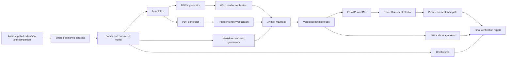

# Task graph

```mermaid
flowchart LR
  A[Audit supplied extension and companion] --> B[Shared semantic contract]
  B --> C[Parser and document model]
  C --> D[Templates]
  D --> E[DOCX generator]
  D --> F[PDF generator]
  C --> G[Markdown and text generators]
  E --> H[Word render verification]
  F --> I[Poppler render verification]
  G --> J[Artifact manifest]
  H --> J
  I --> J
  J --> K[Versioned local storage]
  K --> L[FastAPI and CLI]
  L --> M[React Document Studio]
  M --> N[Browser acceptance path]
  C --> O[Unit fixtures]
  K --> P[API and storage tests]
  N --> Q[Final verification report]
  O --> Q
  P --> Q
```

The clipboard extension and Windows companion are parallel entry surfaces. They share privacy and formatting principles but do not depend on the Document Studio server.
